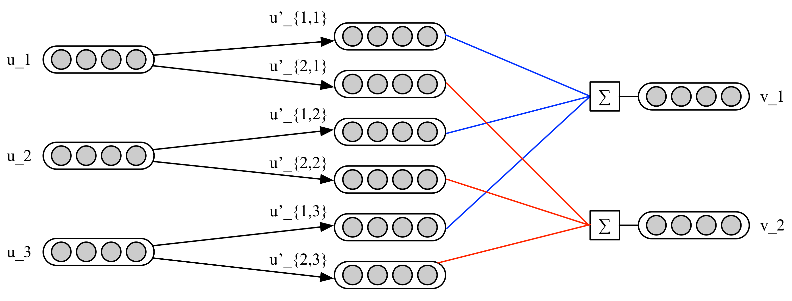

这是一篇在NIPS2017备受关注的论文，[文章链接](https://arxiv.org/pdf/1710.09829.pdf)。作者Sara Sabour, Nicholas Frosst, Geoffrey E. Hinton。

文章主要做了：以向量形式特征表示capsule代替标量形式的特征表示neuron；以iterative routing-by-agreement机制代替max-pooling。

# CNN vs Capsule Network
CNN在特征提取方面具有优势，但其无法表征特征之间的关系。举个例子，一张正常的人脸图片和将这张图片进行嘴和眉毛的错位后的图片，丢给CNN模型预测，得到的结果极有可能一样。CNN的做法是通过更多的data augumentation的例子来训练模型，使模型可以记忆这些变体。不同于CNN, 在该文提出的Capsule，以向量形式表示特征。向量的模长表示该特征出现的概率，向量的方向则代表了特征的一些属性的组合（如位置，颜色等），具有良好的表征。另一方面，在最大池化过程中，CNN通过选择丢弃部分信息而保留了最主要的特征，这对于重叠数字的判别上会存在较大的问题，而Capsule抛弃了池化，用动态路由机制进行前后两层Capsule的信息传递。

# CapsNet结构
在该文中，CapsNet的结构依次为ConvNet Layer, Primary Capsules和Digit Capsules。以MNIST dataset为例，

- 第一层为ReLU Conv: 
    - 1 input to 256 neurons. 
    - $9\times 9$ kernel with 256 channels and a stride of 1
- 第二层为Primary Capsules: 
    - 256 neurons to 8 Capsules.
    - $9\times 9$ kernel with 32 channels and a stride of 2
- 第三层为Digit Capsules: 
    - 8-D Capsules to 16-D capsules
    - output is computed through the transformation matrix $W_ij$ between $u_i$ to $v_j$
    
各层的特征输出维度分别为：

\begin{array}{|ll|}
\hline 
Layer & Shape   \\
- & bn\times 1\times 28\times 28 \\ 
ReLU Conv & bn\times 256\times 20\times 20 \\
Primary Capsules  & bn\times 8\times 32\cdot6\cdot6 \\
Digit Capsules & bn\times 10\times 16\times 1 \\
L_{2norm} & bn\times 10\times 1\times 1 \\ 
\hline
\end{array}

# Routing-by-agreement
下表给出相关的符号说明：
\begin{array}{|lll|}
\hline
v_j & 指L+1层的capsule\ s_j 经过"squashing"的非线性变换\\
s_j & 指L+1层的capsule\ j\\
\hat{u}_{j|i} & 指L层的i经过转换矩阵W_{ij}后的prediction vector(预测向量)\\
c_{j|i} &与u_{j|i}相关的coupling coefficient(耦合系数)\\
u_i & 指L层的capsule\ i \\
W & 转换矩阵 \\
\hline
\end{array}

从L层的capsule $u_i$到L+1层的capsule $v_j$的计算如下：
\begin{align*}
\hat{u}_{j|i} &= W_{ij}u_i\\
s_j &= \sum_ic_{ij}\hat{u}_{j|i}\\
v_j &= \frac{||s_j||^2}{1+||s_j||^2}\frac{s_j}{||s_j||}
\end{align*}

其中转换矩阵$W_{i|j} = m\times k$, 将会通过BP进行更新，$c_{ij}$称为coupling coefficients，可视为加权，将会通过routing-by-agreement更新。根据$\hat{u}_{j|i}=W_{i|j}u_i$，通过转换矩阵$W$与$u$的相乘，可以看出每一个L+1层的capsule $v_j$都会由转移矩阵对应的权重$(j,i)$与L层对应的capsule $u_i$相乘得到。通过这个关系，将会得到capsule $u_i$和capsule $v_j$的共计$j\times i$个值$u_{j|i}$，随后通过耦合系数$c_{j|i}$与$\hat{u}_{j|i}$相乘求和，得到L+1的capsule $v_j$。Routing-by-Agreement的计算过程如下图所示。

耦合系数$c_i$与L+1层的$v_j$和L层的$u_i$都有联系。该系数由动态路由机制进行更新。
该文认为，从该机制中可以看到起初$c_{ij}$对所有的capsule $u_i$都一样对待，但如果prediction vector $\hat{u}_{j|i}$增大，将会影响其对应的耦合系数增加，则其他对应于L层的capsule的耦合系数将会减少，即一种正反馈。下面给出该文的routing-by-agreement的实现方法。

---

procedure ROUTING($\hat{u}_{j|i}, r, l$)

$\quad$for all capsule $i$ in layer $l$ and capsule $j$ in layer $l+1$: $b_{ij}\leftarrow 0$

$\quad$for r iterations do

$\qquad$for all capsule $i$ in layer $l$: $c_i\leftarrow softmax(b_i)$

$\qquad$for all capsule $j$ in layer $l+1$: $s_j\leftarrow \sum_ic_{ij}\hat{u}_{j|i}$

$\qquad$for all capsule $j$ in layer $l+1$: $v_j\leftarrow squash(s_j)$

$\qquad$for all capsule $i$ in layer $l$ and capsule $j$ in layer $l+1$: $b_{ij}\leftarrow b_{ij}+\hat{u}_{j|i}\cdot v_j$

---

# 实验效果

- 抗干扰性：对于数据集的抗干扰性能(robustness)更强。在对MNIST的加入细微的Affine transformation，可以看出Capsule相比CNN识别更加准确。（CNN不做data augumentation的而直接进行比较，存疑）

- 视角变化：对于smallNORB数据集（$96\times 96$的立体灰度图片），实现$2.7\%$的误差，为state-of-art的结果。

- 重叠数字：对于MultiMNIST数据集，该文实验认为Capsule识别重影效果比自己的baseline的CNN好。

备注：此处对reconstruction不作讨论。

